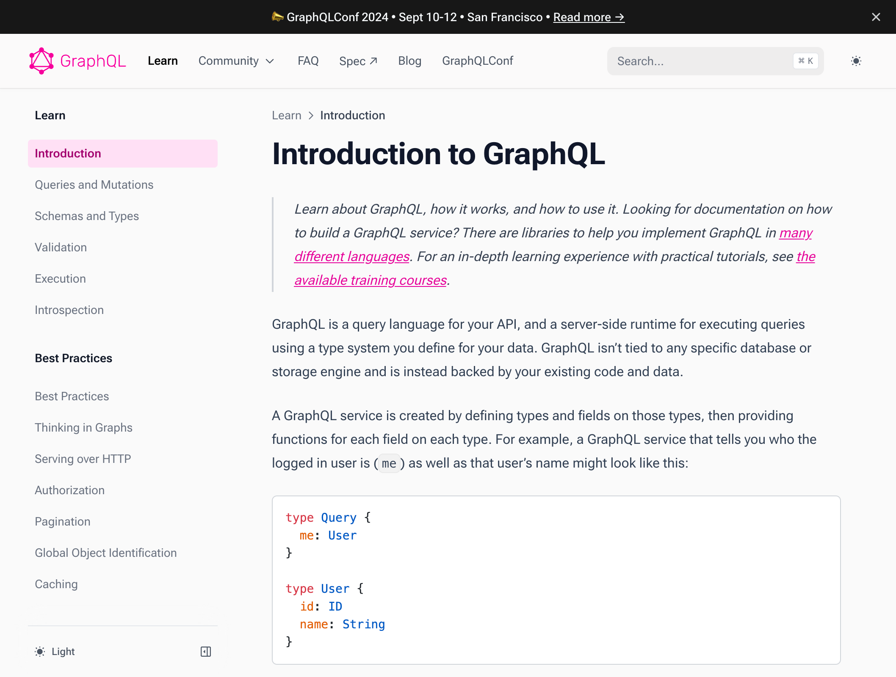
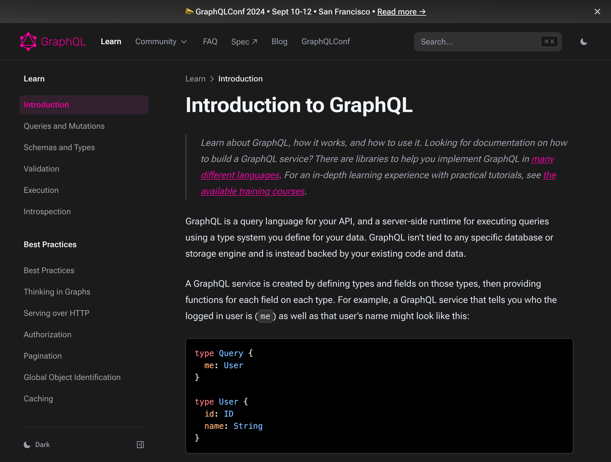

Hi, everyone! I'm [Dimitri Postolov](https://x.com/dimaMachina_) from
[The Guild](https://the-guild.dev), and today I'm excited to announce the new
[graphql.org](/) website.

2 months ago, we released a new GraphQL website after 8 weeks period of development, we're excited
to share with you the reasons behind the changes and what you can expect going forward.

## A Little Dive into History

An initial version of graphql.org v0 was created
[almost 8 years ago](https://github.com/graphql/graphql.github.io/pull/76) by
[Lee Byron](https://x.com/leeb) in 2016.

An initial version of graphql.org v0

Later,
[after 4 years in 2020](https://github.com/graphql/graphql.github.io/pull/896),
the website was migrated to Gatsby by The Guild members
[Saihajpreet Singh](https://x.com/singh_saihaj) and
[Arda Tanrikulu](https://x.com/ardatanrikulu).

graphql.org v1 x Gatsby

All of us GraphQL developers spent a lot of time learning this language from the
"Learn" page, which is shown below, and you definitely remember it!

> Also, we all disliked visiting this page at night due to the lack of a night
> theme. 😅

graphql.org Learn page x Gatsby

With the new website we've made a lot of improvements, including a dark theme!
See how the "Learn" page looks now:

{/* prettier-ignore */}

  <></>
  <></>
  
graphql.org Learn page x Nextra

## What's New

Here is a recap of the new features and improvements we've made to the website:

### Migration to Nextra 3 & Vercel

We migrated from Gatsby & Netlify to [Nextra](https://nextra.vercel.app) and
[Next.js](https://nextjs.org). We chose Nextra because it's a great tool for
building documentation websites, also [The Guild](https://the-guild.dev)
maintains and improves it continuously. This migration helped us to improve the
website's performance and developer experience.

This migration was the final part before releasing the upcoming Nextra version.
You can read my blog post about Nextra 3 in
[The Guild blog](https://the-guild.dev/blog/nextra-3). Recently, we migrated all
The Guild documentation websites to Nextra 3, so we know it's stable
for production.

While migrating this website, I started work on the
future Nextra 4 version with [app router support](https://nextjs.org/docs/app).
Once the first Nextra 4 alpha is out, `graphql.org` will be updated to it!

### New Search Engine

Search was migrated from Algolia to Nextra's built-in search
[Flexsearch](https://github.com/nextapps-de/flexsearch), providing users
with realtime results and improved privacy.

### Light and Dark Themes

For the first time since the creation of graphql.org, we have a dark theme! You
can switch between light and dark themes using the toggle in the top right
corner.

### Improved Accessibility

Accessibility and contrast mode have been improved to make the website more
accessible.

### New [/code](/code) and [/community](/community) Pages

We are excited to show [the new Code](/code) page which was renamed to "Tools
and Libraries". You can read in the
[GitHub repo](https://github.com/graphql/graphql.github.io/blob/source/notes/ContributingToCodePage.md)
how to contribute to this page and add your library or tool.

[The community](/community) page was redesigned and restructured; now you
can find all community resources in one place.

### New [/conf](/conf) Page for GraphQLConf 2024

With the new website, we are excited to announce the upcoming GraphQLConf 2024.
More info can be read on [GraphQLConf 2024 page](/conf/2024) or in
[the official announcement blogpost](/blog/2024-03-28-announcing-graphqlconf-2024).

> Also, you can check [the previous conference GraphQLConf 2023](/conf/2023).

## Conclusion

When I started to learn GraphQL in 2018, I could never have imagined that one day I
would be working on this migration! I am excited to be a part of this journey
and to have finally released the new website, a significant improvement over the old one! 🥳

Subscribe to me in [X](https://x.com/dimaMachina_) and
[GitHub](https://github.com/dimaMachina) and see you at GraphQLConf 2024 🚀.
