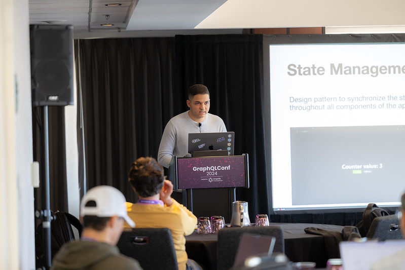

We’re (almost) recuperated from all the excellent talks, socializing, and networking that went down at [GraphQL Conf 2024](https://graphql.org/conf/2024/). It was an event that celebrated the community, and brought GraphQL contributors, Working Group members, and nearly every single TSC member together under one roof for the first time in… a while. Read on for a round-up of the biggest news and takeaways from the conference.

## GraphQL Is Still Expanding
Although GraphQL was originally created to solve the needs of the front-end developer, it has proven its staying power as a tool for all kinds of applications and use cases. For example, GraphQL naturally complements LLMs - several talks highlighted applications for generative AI, AI integrations, and data mesh networks. As Lee Byron noted in his [welcoming keynote](https://youtu.be/ZJHSCyZCup4), GraphQL reached ubiquity and continues to expand as developers discover new ways to apply it to new contexts. 

## Distributed GraphQL has arrived
Distributed GraphQL including Federation was the talk of the conference. We heard about the state of distributed GraphQL from TSC leaders, case studies on production deployment from end-users, and design principles for federated GraphQL from core contributors. Expect to hear a lot more about distributed GraphQL deployments over the next year. 

## Have You Heard the Word About Trusted Documents
Data and application security are as relevant as ever. Our own plucky, GraphQL Community Gardener Benjie Gillam was on hand to tell attendees about one easy thing they can do to harden their GraphQL security posture and boost performance - use Trusted Documents! If you’re already using Trusted Documents, check out [Top 10 GraphQL Security Checks for Every Developer](https://youtu.be/fA81OFu9BVY).

## Our Community had an Amazing Time 
Between the excellent content and workshops, focused unconference sessions, Working Group member chats, TSC and Board meetings, and quality bond-building between attendees, we made the most out of our short time together. We can’t wait to do it again, and are so thankful for our sponsors and attendees for making it all happen. In the words of a few of our attendees:

*“As a beginner in GraphQL, it was very helpful to see real use cases and honest accounts of the challenges along the way. I learned a lot about performance and security and had a great opportunity to network with other participants and potential vendors." - Nicolai Draslov, Danish Agency for Digital Government* 

*"Great community. It's the first conference I've been to where multiple people remembered me from previous conferences."*

*"GraphQL is evolving to new use cases every day and it's really a competitive advantage to experience them first hand with everyone that matters. I look forward the next edition!" - Vincent Desmares, Teamstarter*

*"GraphQLConf 24 was a well organized event that empowered new and existing organizations to adopt GraphQL, navigating how to rollout GraphQL within their organizations by building understanding of eco-system." - Satish Chitnis* 

## GraphQL Conf 2025 is coming to Europe!
Lee Byron shared that the GraphQL Foundation Board is committed to hosting the next edition of GraphQL Conf somewhere in Europe in 2025. Planning is still in the early stages, so stay tuned, but this was welcome news for the dozens of community members who flew in from as far away as Belgium to join us in San Francisco.

**Interested in getting involved? Drop a line to graphqlconf@graphql.org!**

If you want to relive the experience of GraphQL Conf or just re-watch and share a favorite talk, you can check out all the [photos](https://www.flickr.com/photos/linuxfoundation/albums/72177720320386221/) and [videos](https://graphql.org/conf/2024/schedule/) on our conference website. Subscribe to our [Working Group YouTube](https://www.youtube.com/@GraphQLFoundation), new [Foundation Events YouTube](https://www.youtube.com/@GraphQLFoundationTalks), [X](https://twitter.com/graphql), and [LinkedIn](https://www.linkedin.com/company/graphql-foundation/) channels to get content you may have missed and find out when we launch the new GraphQL Conf 2025 website!
