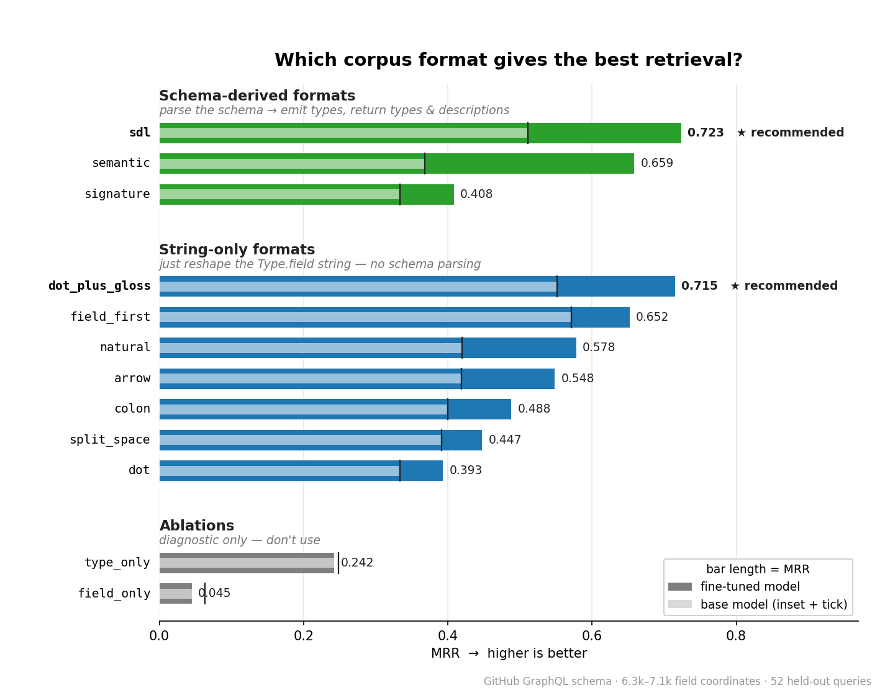

When you point an AI agent at a GraphQL API, the hard part isn't writing the query. It's finding the right fields in the first place. Real schemas are wide. A typical production schema carries thousands of `Type.field` coordinates, and most of them won't fit in a model's context window at once. The agent needs to retrieve the handful of fields that answer the question, and only then write a query against them.

This is a classic retrieval problem, and the usual answer is RAG: embed every coordinate or type, as well as the user's question, and pull the top matches. It works well for documentation. It works less well for GraphQL, and the reason is specific to how schemas are designed.

## Why general-purpose embedders struggle with schemas

Schemas reuse field names everywhere. Dozens of types carry a `description`. Many carry an `author`, a `state`, a `createdAt`, a `priceCents`. Knowing the field name is rarely enough. You have to know *whose* field it is.

Take a question like *"What's the nightly rate for this room?"*. The right answer is `Room.priceCents`. But the schema may also carry `RoomUpgradeOffer.priceCents`, `RoomExtension.priceCents`, `Ticket.priceCents`, and more. A general-purpose embedder doesn't always resolve that ambiguity well, and often ranks the wrong owner first.

The same pattern shows up on bigger schemas. The public GitHub GraphQL schema has **262 distinct `.description` fields** across types like `Issue`, `Incident`, `Resolution`, `SatisfactionSurvey`, `SlaPolicy`, and many more. Retrieval here isn't really about picking the right field name. It's about picking the right *owner type* for a name that appears hundreds of times.

This owner-type disambiguation is what general embedders are weakest at, and it's exactly what an agent needs to be reliable.

## A small, focused fine-tune

A natural experiment is to fine-tune a general embedder on this specific task: mapping a natural-language question to the `Type.field` coordinate that answers it, with an emphasis on disambiguating between same-named fields on different owner types. The artifact discussed in this post is [`Qwen3-Embedding-0.6B-GraphQL`](https://huggingface.co/xthor/Qwen3-Embedding-0.6B-GraphQL), an open-source ([Apache 2.0](https://www.apache.org/licenses/LICENSE-2.0)) fine-tune of [`Qwen3-Embedding-0.6B`](https://huggingface.co/Qwen/Qwen3-Embedding-0.6B). It's an early prototype shared here as a reference point for schema-aware retrieval, and the methodology generalizes to any base embedder.

At 0.6B parameters, the model runs on CPU, or comfortably alongside an agent's own model on the same GPU. The weights are published as SentenceTransformers and as GGUF builds for `llama.cpp` and Ollama.

The most realistic evaluation is against a schema the model has never seen before. Running it on the full [GitHub GraphQL schema](https://github.com/octokit/graphql-schema), with 6,342 coordinates and 52 natural-language queries that were not part of training:

| metric    | base  | tuned     | lift   |
|-----------|-------|-----------|--------|
| MRR       | 0.511 | **0.723** | +41%   |
| Recall@1  | 0.385 | **0.615** | +60%   |
| Recall@5  | 0.654 | **0.865** | +32%   |

The lift is most pronounced on indirect questions that name a concept rather than a field, and that require the model to pick the right owner.

## A concrete example

> *"I need to understand what commitments we have regarding support response times. Where can I find that info?"*

The correct answer in this schema is `SlaPolicy.description`. Among the 262 candidate `.description` fields:

- The base model ranks `SatisfactionSurvey.description` and `Incident.description` above the target. `SlaPolicy.description` lands at rank **101** in the full corpus.
- The fine-tuned model ranks `SlaPolicy.description` at rank **1**, with the wrong owners demoted from a cosine of about 0.45 down to 0.15 to 0.22.

The field name carries no signal here, since every candidate is `.description`. The owner type is what carries the signal, and that is what the fine-tune learned to weight.

## Using it

The model is a drop-in for any GraphQL-aware retrieval, query builder, or schema search. The snippet below loads the model and runs it entirely on the local machine, with no API calls and no network round trip:

```python
from sentence_transformers import SentenceTransformer

model = SentenceTransformer("xthor/Qwen3-Embedding-0.6B-GraphQL")

query = "What's the nightly rate for this room?"
coords = [
    "Room.priceCents",
    "RoomUpgradeOffer.priceCents",
    "Ticket.priceCents",
]

q = model.encode(query, prompt_name="query")
c = model.encode(coords, prompt_name="document")
scores = (q @ c.T).tolist()
```

No hosted API is involved. The Q8 GGUF weights are about 650 MB on disk and use roughly 1 to 1.5 GB of RAM at runtime. The Q4 quantization fits in about 400 MB.

The size was a deliberate constraint. A 0.6B embedder fits where a hosted API or a multi-billion-parameter model doesn't:

- **Inside your GraphQL gateway or BFF**, so the same process that resolves the schema also indexes it.
- **On a developer laptop**, fully offline, for local agent loops and CI checks.
- **On edge runtimes** like a long-running container at the edge, an on-prem box, or a sidecar to your existing API service. Each query takes tens to low-hundreds of milliseconds on CPU, so a small instance with no GPU handles realistic agent traffic.
- **Alongside your agent's main model on the same GPU**, where it adds well under a gigabyte of VRAM.

For local serving, `model-q8_0.gguf` runs near-losslessly on Ollama or `llama-server` and exposes an OpenAI-compatible embeddings endpoint, so the same code that talks to a hosted provider can talk to it instead.

## How you format the corpus matters as much as the model

One finding from the work is worth surfacing on its own. **How you render each coordinate to text before embedding it has roughly the same impact on retrieval as the fine-tune itself, and the two stack.**

On the GitHub schema benchmark, embedding raw `Type.field` identifiers like `PullRequest.baseRefName` gives an MRR of 0.39 with the tuned model. Switching to a short SDL snippet, or to a one-line gloss like *"PullRequest.baseRefName: the base ref name of a pull request"*, raises that to **0.72**. The base model gets a similar bump from the same change. The fine-tune then adds another ~0.2 MRR on top of whichever format you pick.



SDL and a one-line gloss tie at the top. Raw identifiers and ablations that drop either the owner type or the field name fall off sharply.

The lesson generalizes: if you're building schema retrieval for an agent, spend as much time on how you render each coordinate as on which embedder you pick. The owner type and a short human-readable label belong in the embedded text. Bare identifiers throw away most of the signal, and no embedder can fully recover from that.

## Why this matters for the ecosystem

GraphQL's introspection has always been one of its strongest features. Every schema is self-describing, and tools can walk it programmatically. As AI agents become a meaningful consumer of GraphQL APIs, that self-describing surface becomes the substrate they navigate to do useful work. Making schemas legible to retrieval systems is part of making GraphQL legible to agents.

A focused, small embedding model is one piece of that. There's plenty more to do: within-owner field disambiguation, multilingual queries, very long schemas with deep nesting, schemas with custom directives that carry semantic weight. But the first step is recognizing that schema retrieval is a distinct problem from prose retrieval, and that purpose-built tooling helps.

If you're building agents against GraphQL and have schema retrieval pain, give it a try, and please share what you find. The model, training data, and benchmarks are all open:

- Model: [huggingface.co/xthor/Qwen3-Embedding-0.6B-GraphQL](https://huggingface.co/xthor/Qwen3-Embedding-0.6B-GraphQL)
- Training code and benchmarks: [github.com/ThoreKoritzius/graphql-embedding-model](https://github.com/ThoreKoritzius/graphql-embedding-model)
- Base model: [Qwen3-Embedding-0.6B](https://huggingface.co/Qwen/Qwen3-Embedding-0.6B)

Feedback, schemas to benchmark against, and PRs are all welcome.
