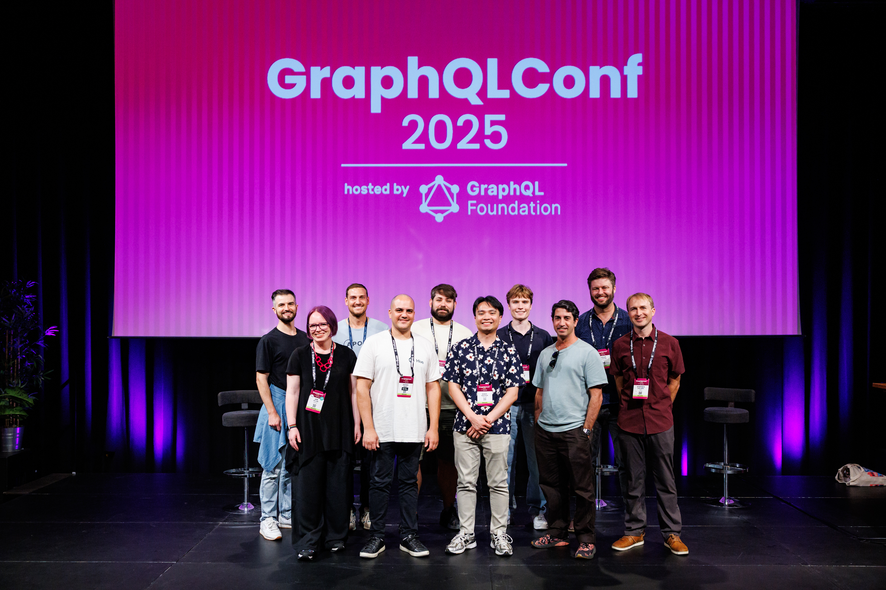
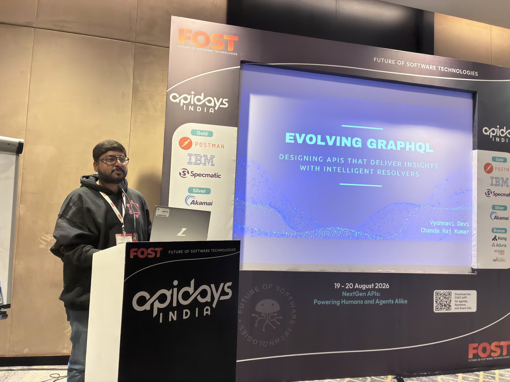
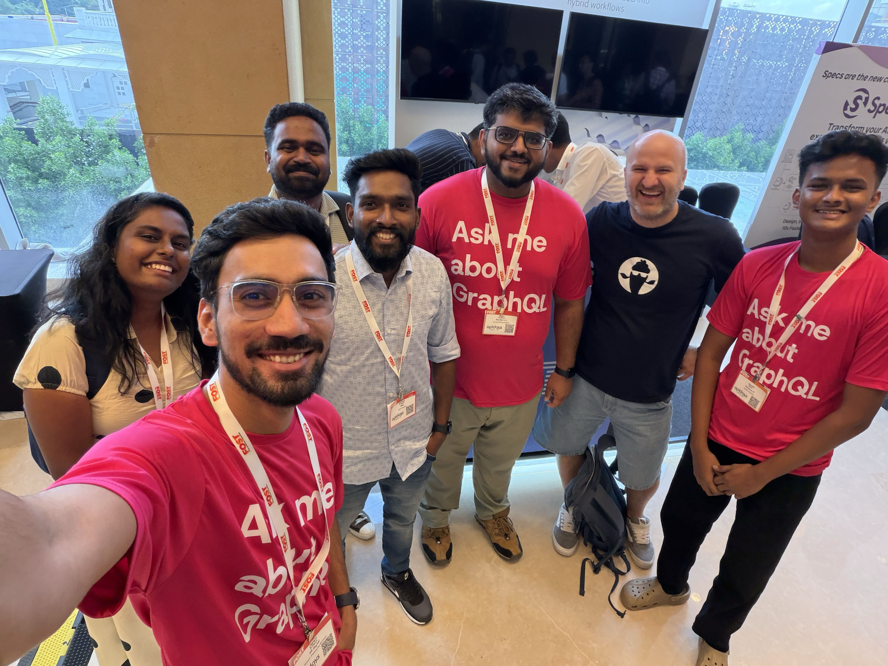
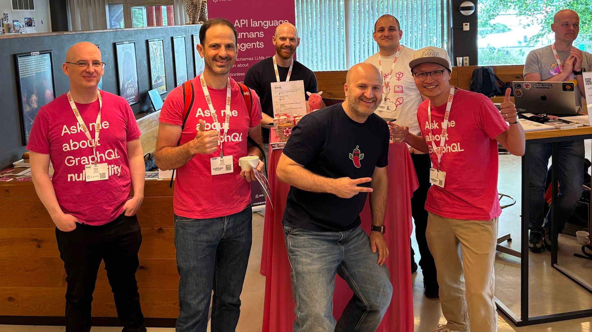
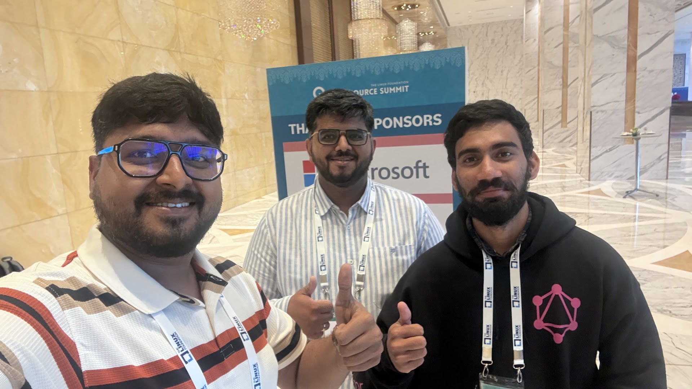

import { AmbassadorGrid } from "../../../components/ambassador-grid"
import { ambassadors202509 } from "../../../components/info-card/ambassador-data"
import { ambassadors202609 } from "../../../components/info-card/ambassador-data"

One year ago, the GraphQL Foundation launched the Ambassador Program to recognize and support the people helping GraphQL communities grow around the
world. Since then, our Ambassadors have brought people together, maintained the tools the ecosystem relies on, shared what they know, and helped more developers find a way into the GraphQL community.

As the program begins its second year, we are delighted to welcome two new Ambassadors, celebrate some of the work our Ambassadors have done over the past 12 months, and thank the six members of our first cohort who will become our
first Ambassador Emeriti.

## Welcome Eeshaan and Jean Lucas

<AmbassadorGrid ambassadors={ambassadors202609} concise />

Eeshaan Sawant joins us as an independent open-source advocate with experience as a maintainer of CNCF projects and a strong interest in developer relations and technical writing. He has already begun organizing an unconference session
for [GraphQL Day Melbourne](https://graphql.org/day/) and recently published [The State of GraphQL in 2026: Is GraphQL Really Dead?](https://x.com/eeshaantwts/status/2087468187365622245),
his own assessment of how the ecosystem is changing. We are excited to see how his experience in other open-source communities can help GraphQL reach new people and create more opportunities for participation.

Jean Lucas Lima first encountered GraphQL through his work on Viaduct, Airbnb’s multi-tenant GraphQL server. He helped shape GraphQLConf 2026 as a member of its conference committee, and at the event he organized the [GraphQL Production Roundtable](https://www.linkedin.com/feed/update/urn:li:activity:7462926654991159296/) and presented _Turning San Francisco Into a GraphQL Server_. Jean Lucas also founded ConfrariaTech, a network for technology leaders in Brazil, and has years of experience building and sustaining technical communities. He will be our first Brazilian GraphQL Ambassador, and we look forward to supporting his continued involvement in GraphQL. You can find more of Jean Lucas' talks, podcasts, and writing on his [personal website](https://www.jeanlucas.me/en/appearances).

## A year of bringing people together

The first year of the program has shown how many different forms community work
can take.

At [GraphQLConf 2026](https://graphql.org/conf/2026/schedule/), Ambassadors took to the stage to discuss subjects ranging from React Server Components, schema design, and type safety to production systems, developer tools, education, and
AI. They also helped shape the event behind the scenes, brought production practitioners together for panel discussions, and welcomed attendees into the wider GraphQL community.

<figure className="mx-auto max-w-xl max-w-full">
  
</figure>

Ambassadors have helped organize and support GraphQL Day events in Singapore, Amsterdam, and Bengaluru. In Amsterdam, An and Christian built on GraphQLConf 2025 to help bring GraphQL Day to the city, running the booth, and keeping everyone fuelled with stroopwafels along the way! At GraphQL Day Singapore, Akshat helped run a GraphQL booth and later [shared what he learned](https://graphql.org/blog/2026-06-02-learning-graphql-to-representing-it-at-api-days-singapore/) from speaking with developers who were evaluating GraphQL or already facing production challenges. In Bengaluru, Raj Kumar spoke about intelligent resolvers while Rigin, Jayant, and Ayush, alongside TSC members, spent time at the booth answering questions and introducing new people to GraphQL. We are looking forward to Ambassadors supporting GraphQL Days in London and Paris in the last quarter of this year.

  <figure className="mx-auto w-64">
    
  </figure>
  <figure className="mx-auto w-64">
    
  </figure>
  <figure className="mx-auto w-64">
    
  </figure>

GraphQL Locals also brought people together in Amsterdam, Hyderabad, London, and Philadelphia, creating space for practical questions and candid conversations. After becoming one of our first Ambassadors, Sarah teamed up with fellow Philadelphian Graham to launch [Philly GraphQL](https://luma.com/phillygraphql). Their first meetup welcomed 29 people for an introductory talk, Q&A, and a conversation about what the new community wanted from future events. We are also looking forward to the first [GraphQL Virtual meetup](https://guild.host/events/graphql-virtual-meetup-zywc3q), which Jeff is organizing for September, and Emily’s launch of [GraphQL Toronto](https://guild.host/graphql-toronto) with a casual community roundtable in October.

## Supporting the tools people use

Much of the work that keeps an open-source ecosystem healthy happens away from the stage. Ambassadors continue to build and maintain projects including GraphQL Code Generator, GraphQL Editor, Grafast, Grats, Hive, GraphQL Network Inspector, Relay, Strawberry GraphQL, Yoga, and GraphQL Zeus.

There were some important milestones along the way. Eddy led a [major overhaul of GraphQL Code Generator's client types](https://the-guild.dev/graphql/hive/blog/graphql-codegen-client-v6-202604), producing less generated code, stronger types, and a simpler setup. Warren continued developing [GraphQL Network Inspector](https://chromewebstore.google.com/detail/graphql-network-inspector/ndlbedplllcgconngcnfmkadhokfaaln), whose Chrome extension now has more than 100,000 users and supports subscriptions over WebSockets and server-sent events, as well as multipart responses used by `@defer`.

## Taking GraphQL into the wider ecosystem

Ambassadors have also taken GraphQL into open-source and developer communities beyond our own events. Our presence at [Open Source Summit India](https://events.linuxfoundation.org/open-source-summit-india/) came directly from Rigin, Raj Kumar, and Jayant, who spotted the opportunity and made it happen. Together, they helped developers and maintainers from across the open-source ecosystem explore GraphQL and showed new people how they could participate.

Željko has been doing similar outreach in the Java community. At [JConf Dominicana](https://jconfdominicana.org/) in July, he led a hands-on workshop that took participants from an empty project to a production-ready GraphQL API. In October, he will bring GraphQL to the wider data and developer audience at [J On The Beach](https://jonthebeach.com/workshops/), with a workshop combining GraphQL, MCP, and AI agents.

<figure className="mx-auto max-w-xl max-w-full">
  
</figure>

Others have been reaching the community through their own channels. Jeff has kept up a steady stream of [engaging video content](https://www.youtube.com/@JeffAuriemma) for developers learning GraphQL, and Dotan continues to keep the community informed through [GraphQL Weekly](https://www.graphqlweekly.com/), the newsletter for GraphQL users, both seasoned and casual.

## Thank you to our first Ambassador Emeriti

As our first Ambassadors reach the end of their terms, Donna, Jovi, Marc-Andre, Michael, Phil and Taz will become the program's first Ambassador Emeriti.

Ambassador Emeriti are former Ambassadors whose active terms have ended. They remain valued members of the Ambassador community and are welcome to stay connected through our discussions, calls, and other opportunities to participate, without the activity requirements of a current Ambassador term.

These six talented folks joined us when the Ambassador Program was still only an idea waiting to be tested. By stepping forward as members of our first cohort, they helped establish the program and show what it could become. We celebrate and thank them for the time, experience, and care they have shared with the program and the wider GraphQL community. Their contributions have helped make GraphQL stronger, more welcoming, and more connected.

We are incredibly grateful for the part they have played, and proud to recognize them as our first Ambassador Emeriti.

<AmbassadorGrid ambassadors={ambassadors202509.filter(ambassador => ambassador.emeritus)} concise />

## How to Get Involved

- **Nominate an Ambassador.** Do you know someone doing incredible work with GraphQL? [Nominate them](https://forms.gle/hN7reX8aKQ6BqSJm7) (or [yourself](https://forms.gle/zRKVfcTPQ9kFn4Ps6))!

- **Connect locally.** Attend [events and workshops](/community/events/) hosted by Ambassadors in your region.

- **Share your story.** If you’re publishing, teaching, or building with GraphQL, we’d love to hear from you.
